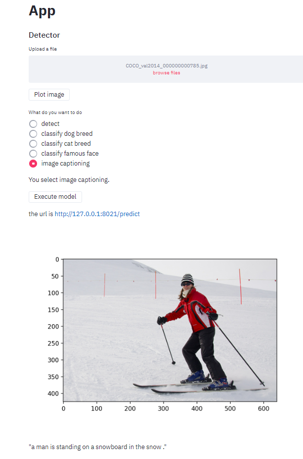

# image capabilities service

This api receives an image and predict a description of this image

Each version is a improve from previous versions
# versions:

# Screenshot

# run 

uvicorn backend:app --reload --port 8021

http://127.0.0.1:8021/docs#/default